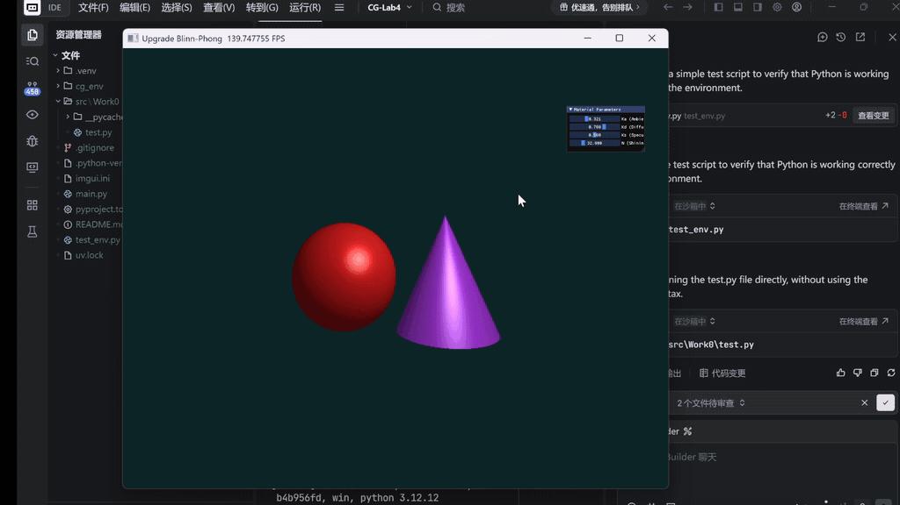

# 计算机图形学实验四报告
## 基于 Taichi 的 Phong / Blinn-Phong 光照模型与硬阴影渲染

---

## 一、实验内容概述

本次实验以**Phong 局部光照模型**为核心，在Taichi框架下，通过数学方式（光线投射 Ray Casting）构建三维场景，实现了从几何求交、着色计算到交互式 UI 的渲染管线。

**基础任务**涵盖：
1. 在 Taichi Kernel 中以隐式方程定义红色球体与紫色圆锥两个几何体；
2. 实现逐像素的光线投射与基于深度竞争（类 Z-buffer）的遮挡测试；
3. 按照 Phong 光照公式分别计算环境光、漫反射、镜面高光并叠加输出；
4. 使用 `ti.ui` 创建交互面板，支持 $K_a$、$K_d$、$K_s$、Shininess 四个参数的实时滑动调节。

**选做任务**在基础任务之上进一步扩展：
- **选做 1**：将 Phong 高光模型升级为 **Blinn-Phong** 模型（引入半程向量 $\mathbf{H}$），并分析二者在大入射角区域的视觉表现差异；
- **选做 2**：实现**硬阴影（Hard Shadow）**，在交点处向光源发射暗影射线，若被遮挡则该点仅保留环境光分量。

---

## 二、项目框架

```
.
├── .venv/                  # Python 虚拟环境（venv）
├── cg_env/                 # Taichi 专用环境
├── src/
│   └── Work0/
│       ├── __pycache__/
│       └── test.py         # 本次实验主程序（完整实现）
├── .gitignore
├── .python-version
├── imgui.ini               # ImGui 窗口布局缓存
├── main.py                 # 入口脚本
├── pyproject.toml          # 项目依赖配置
├── README.md
├── test_env.py             # 环境检测脚本
└── uv.lock                 # 依赖锁定文件
```

> 核心代码位于 `src/Work0/test.py`，实验所有渲染逻辑均在该文件中实现。

---

## 三、基础实验简述

### 3.1 Phong 光照模型原理

Phong 模型将物体表面接收的光分解为三个独立分量后叠加：

$$I = I_{\text{ambient}} + I_{\text{diffuse}} + I_{\text{specular}}$$

| 分量 | 公式 | 物理含义 |
|:---|:---|:---|
| 环境光 | $I_a = K_a \cdot C_{\text{light}} \cdot C_{\text{object}}$ | 模拟多次散射后的均匀背景光 |
| 漫反射 | $I_d = K_d \cdot \max(0, \mathbf{N} \cdot \mathbf{L}) \cdot C_{\text{light}} \cdot C_{\text{object}}$ | Lambert 漫散射，与入射角余弦成正比 |
| 镜面高光 | $I_s = K_s \cdot \max(0, \mathbf{R} \cdot \mathbf{V})^n \cdot C_{\text{light}}$ | 光滑表面的定向反射高光 |

其中 $\mathbf{N}$ 为表面单位法向量，$\mathbf{L}$ 为指向光源的单位向量，$\mathbf{V}$ 为指向摄像机的单位向量，$\mathbf{R} = \mathbf{L} - 2(\mathbf{L} \cdot \mathbf{N})\mathbf{N}$ 为理想镜面反射方向，$n$ 为高光指数（Shininess）。

### 3.2 场景构建

- **红色球体**：圆心 $(-1.2,\ -0.2,\ 0)$，半径 $r = 1.2$，基础色 $(0.8, 0.1, 0.1)$，位于画面左侧。
- **紫色圆锥**：顶点 $(1.2,\ 1.2,\ 0)$，底面 $y = -1.8$，底面半径 $1.2$，基础色 $(0.6, 0.2, 0.8)$，位于画面右侧。
- **灰色地面**：水平面 $y = -1.8$，颜色 $(0.6, 0.6, 0.6)$，承接两物体阴影。
- **摄像机**：固定在 $(0,\ 2.5,\ 6.0)$，朝向场景中心。
- **点光源**：位于 $(2,\ 3,\ 4)$，纯白光 $(1.0, 1.0, 1.0)$。
- **背景色**：深青色 $(0.05,\ 0.15,\ 0.15)$。

### 3.3 光线求交与深度测试

对每个像素 $(i, j)$ 生成一条从摄像机出发的射线：

$$\text{ray} : \mathbf{p}(t) = \mathbf{o} + t \cdot \mathbf{d}, \quad t > 0$$

分别与球体、圆锥、地面求解交点参数 $t$，取**最小正值** $t_{\min}$ 对应物体进行着色，实现正确的遮挡关系（等价于 Z-buffer 深度竞争）。

**球体求交**（解析解）：将光线方程代入球面方程 $|\mathbf{p} - \mathbf{c}|^2 = r^2$，整理得二次方程 $t^2 + bt + c = 0$，取正根中的较小值。

**圆锥求交**：将光线变换至以顶点为原点的局部坐标系，利用圆锥隐式方程 $x^2 + z^2 = k^2 y^2$（$k = r/H$）构造二次方程，求解后验证交点的 $y$ 坐标是否落在 $[-H,\ 0]$ 高度范围内。

**圆锥法向量**：局部坐标下法线为 $\mathbf{n} = (p_x,\ -k^2 p_y,\ p_z)$，归一化后变换回世界空间。

### 3.4 交互 UI 参数面板

使用 `ti.ui.Window` 的 `gui.sub_window` + `gui.slider_float` 实现四个实时参数控制，参数范围与默认值如下：

| 参数 | 含义 | 范围 | 默认值 |
|:---:|:---|:---:|:---:|
| $K_a$ | 环境光系数 | $[0.0,\ 1.0]$ | $0.2$ |
| $K_d$ | 漫反射系数 | $[0.0,\ 1.0]$ | $0.7$ |
| $K_s$ | 镜面高光系数 | $[0.0,\ 1.0]$ | $0.5$ |
| $n$ (Shininess) | 高光指数 | $[1.0,\ 128.0]$ | $32.0$ |

---

## 四、选做 1：Blinn-Phong 模型升级

### 4.1 理论分析

**标准 Phong 模型**计算高光时，使用反射向量 $\mathbf{R}$ 与视线向量 $\mathbf{V}$ 的夹角：

$$I_s^{\text{Phong}} = K_s \cdot \max(0,\ \mathbf{R} \cdot \mathbf{V})^n$$

其中 $\mathbf{R} = 2(\mathbf{N} \cdot \mathbf{L})\mathbf{N} - \mathbf{L}$。

**Blinn-Phong 模型**由 James Blinn 提出，使用**半程向量（Halfway Vector）** $\mathbf{H}$ 代替反射向量参与点积计算：

$$\mathbf{H} = \frac{\mathbf{L} + \mathbf{V}}{|\mathbf{L} + \mathbf{V}|}$$

$$I_s^{\text{Blinn-Phong}} = K_s \cdot \max(0,\ \mathbf{N} \cdot \mathbf{H})^n$$

**两者在大入射角时的视觉表现差异：**

当光线以较大入射角（即 $\mathbf{L}$ 与 $\mathbf{N}$ 夹角接近 $90°$）照射物体表面时，Phong 模型的反射向量 $\mathbf{R}$ 会偏转至物体背面，此时若视线方向 $\mathbf{V}$ 与 $\mathbf{R}$ 夹角超过 $90°$，点积截断为 $0$，导致**高光区域边缘出现硬切断（Hard Cutoff）**，形成不自然的明暗突变，在大曲率表面上尤为明显。

Blinn-Phong 模型中 $\mathbf{N} \cdot \mathbf{H}$ 在同等条件下不会出现如此剧烈的截断，高光衰减更为平滑连续，边缘过渡更加自然。此外，半程向量计算相比反射向量计算开销更低（无需 `reflect` 运算），在工程上也更为高效。

> **总结**：对于大入射角场景，Blinn-Phong的高光边缘更柔和，消除了Phong模型的"硬截边"伪影；两者在中小入射角下视觉差异较小，但Blinn-Phong整体高光叶形更宽，因此相同Shininess值下高光范围略大。

### 4.2 实现方法

将原 Phong 着色器中反射向量的计算：

```python
# Phong（原始）
R = reflect(-L, N)
spec = ti.max(0.0, R.dot(V)) ** shininess[None]
```

替换为半程向量的计算：

```python
# Blinn-Phong（升级后）
H = normalize(L + V)
spec = ti.max(0.0, N.dot(H)) ** shininess[None]
```

在本实验代码中，最终提交版本已采用 **Blinn-Phong** 模型（见 `render()` 函数中高光计算部分）：

```python
# 修改为半程向量计算（Blinn-Phong）
H = normalize(L + V)
spec = ti.max(0.0, N.dot(H)) ** shininess[None]
specular = Ks[None] * spec * light_color
```

---

## 五、选做 2：硬阴影（Hard Shadow）

### 5.1 理论分析

硬阴影（Hard Shadow）基于**暗影射线（Shadow Ray）**技术。其核心思想是：在光线与物体表面的交点处，向光源方向额外发射一条测试射线。若该测试射线在到达光源之前被场景中的其他几何体遮挡，则说明交点处于阴影之中，此时该点无法接收直接光照，仅保留**环境光**分量；反之，则执行完整的Blinn-Phong着色计算。

$$\text{color} = \begin{cases} I_{\text{ambient}} & \text{if shadow ray is blocked} \\ I_{\text{ambient}} + I_{\text{diffuse}} + I_{\text{specular}} & \text{otherwise} \end{cases}$$

硬阴影在现实中对应完全点光源的情形，阴影边界清晰锐利，无半影过渡区域。

### 5.2 实现方法

在代码中定义 `in_shadow(p, N, light_pos)` 函数：

```python
@ti.func
def in_shadow(p, N, light_pos):
    shadow = False
    eps = 1e-4
    # 沿法线方向偏移，避免自交（Self-Intersection）
    shadow_ro = p + eps * N
    shadow_rd = normalize(light_pos - p)
    light_dist = (light_pos - p).norm()
    
    # 检测暗影射线是否被球体遮挡
    t_sph, _ = intersect_sphere(shadow_ro, shadow_rd,
                                 ti.Vector([-1.2, -0.2, 0.0]), 1.2)
    if 0 < t_sph < light_dist:
        shadow = True
    
    # 检测暗影射线是否被圆锥遮挡
    t_cone, _ = intersect_cone(shadow_ro, shadow_rd,
                                ti.Vector([1.2, 1.2, 0.0]), -1.8, 1.2)
    if 0 < t_cone < light_dist:
        shadow = True
        
    return shadow
```

**关键细节：**

- **自交偏移（Epsilon Offset）**：暗影射线的起点沿表面法线方向偏移 $\varepsilon = 10^{-4}$，防止射线与当前交点所在表面发生自相交而产生噪点伪影；
- **距离截断**：仅当遮挡体交点 $t$ 满足 $0 < t < |\mathbf{p}_{\text{light}} - \mathbf{p}|$ 时才判定为遮挡，确保光源后方的物体不会错误产生阴影；
- **地面阴影接收**：球体与圆锥的阴影可正确投射到地面上，地面本身不向自身投阴影（地面法线向上，暗影射线起点已偏移至地面以上）。

在 `render()` 主核函数中，着色逻辑根据阴影检测结果分支：

```python
ambient = Ka[None] * light_color * hit_color

if in_shadow(p, N, light_pos):
    color = ambient           # 阴影区：仅环境光
else:
    # 非阴影区：完整 Blinn-Phong
    diff    = ti.max(0.0, N.dot(L))
    diffuse = Kd[None] * diff * light_color * hit_color
    H       = normalize(L + V)
    spec    = ti.max(0.0, N.dot(H)) ** shininess[None]
    specular = Ks[None] * spec * light_color
    color   = ambient + diffuse + specular
```

---

## 六、代码逻辑总览

### 6.1 整体渲染管线

```
主循环（Python）
    │
    ├─ render() ← @ti.kernel（GPU 并行，逐像素执行）
    │       │
    │       ├─ 生成射线 (ro, rd)
    │       │
    │       ├─ 几何求交
    │       │     ├─ intersect_sphere()   → (t, normal)
    │       │     ├─ intersect_cone()     → (t, normal)
    │       │     └─ intersect_plane()    → (t, normal)
    │       │
    │       ├─ 深度竞争：取最小正 t
    │       │
    │       ├─ 命中处理
    │       │     ├─ 计算 L, V, H
    │       │     ├─ in_shadow() → 暗影射线检测
    │       │     └─ Blinn-Phong 着色 (ambient / full)
    │       │
    │       └─ clamp → pixels[i, j]
    │
    ├─ canvas.set_image(pixels)
    │
    └─ GUI 滑动条 → Ka, Kd, Ks, shininess 实时更新
```

### 6.2 关键函数说明

| 函数 | 类型 | 功能说明 |
|:---|:---:|:---|
| `intersect_sphere(ro, rd, center, radius)` | `@ti.func` | 解析法求光线-球体交点，返回 $(t, \mathbf{N})$ |
| `intersect_cone(ro, rd, apex, base_y, radius)` | `@ti.func` | 局部坐标系下求光线-圆锥交点，含高度裁剪，返回 $(t, \mathbf{N})$ |
| `intersect_plane(ro, rd, y_pos)` | `@ti.func` | 求光线-水平地面交点，返回 $(t, \mathbf{N})$ |
| `in_shadow(p, N, light_pos)` | `@ti.func` | 发射暗影射线，检测交点是否被球/锥遮挡 |
| `normalize(v)` | `@ti.func` | 向量归一化（含小量保护防除零） |
| `reflect(I, N)` | `@ti.func` | 计算反射向量（备用，当前升级为 Blinn-Phong） |
| `render()` | `@ti.kernel` | 主渲染核函数，GPU 并行，逐像素执行完整管线 |
| `main()` | Python | 窗口初始化、主循环、UI 交互绑定 |

### 6.3 注意事项与调试要点

- **向量归一化**：参与光照点积的 $\mathbf{N}$、$\mathbf{L}$、$\mathbf{V}$、$\mathbf{H}$ 均须为单位向量，否则出现全黑或异常高光；
- **负值截断**：漫反射和高光中均使用 `ti.max(0.0, ...)` 截断负值，避免背光面出现负色值；
- **颜色截幅**：最终写入 `pixels` 前使用 `ti.math.clamp(color, 0.0, 1.0)` 防止过曝发白；
- **自交偏移**：暗影射线起点沿法线偏移 $\varepsilon$，消除自阴影噪点。

---

## 七、效果呈现

### 7.1 基础实验效果展示
<div align="center">
    
</div>

### 7.2 用半程向量计算的Blinn-Phong模型展示
<div align="center">
    
</div>

### 7.3 加入硬阴影的模型展示
<div align="center">
    
</div>

最终渲染效果（默认参数 $K_a=0.2,\ K_d=0.7,\ K_s=0.5,\ n=32$）呈现以下特征：

- **红色球体**（左）与**紫色圆锥**（右）通过深度测试正确遮挡，边缘处无穿插伪影；
- Blinn-Phong 高光在两个物体的受光侧形成平滑、自然的高光叶，无硬截边现象；
- 点光源在球体和圆锥底部于**灰色地面**上投射出清晰的**硬阴影**，阴影区域仅显示环境光，轮廓锐利；
- 暗影射线的$\varepsilon$偏移有效消除了地面和物体表面的自阴影噪点；
- 通过右上角交互面板实时调节参数：增大$K_a$提亮阴影区域，增大$n$使高光区域收缩变锐，效果均实时响应。


